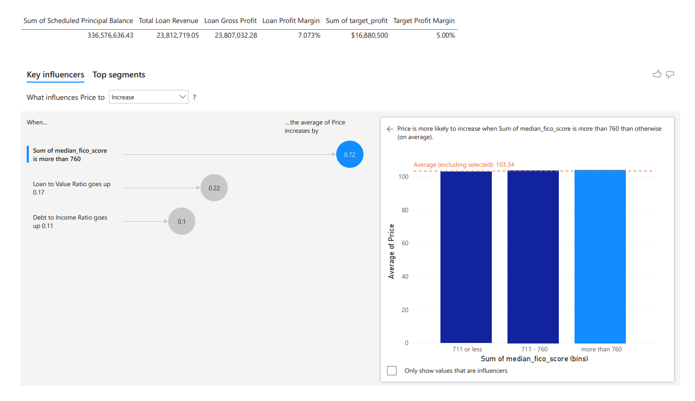
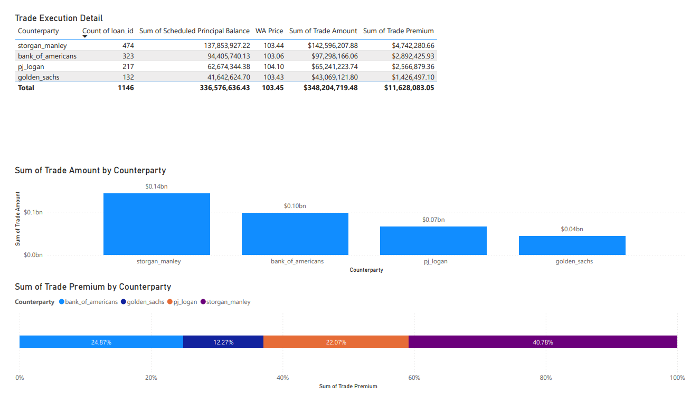

# Mortgage Trading Analysis: Secondary Market Optimization

## Project Overview

This Power BI case study simulates a junior trader role on a mortgage origination trading desk, analyzing $336M+ in mortgage portfolios to optimize secondary market pricing and maximize profitability. The project evaluates bidding strategies, credit-based pricing models, and counterparty partnerships across 1,146 residential loans.

**Business Context:** As a mortgage originator, the company packages and sells mortgages to investment banks. This analysis optimizes pricing strategies to maximize profit margins while managing credit risk.

---

## Dashboard Visualizations

### Key Findings: Credit Score Impact on Pricing
*Key influencer analysis revealing 72 bps pricing premium for borrowers with FICO scores above 760*

### Profit Analysis Dashboard

*Comprehensive view of portfolio performance: $23.81M revenue, 7.07% profit margin, exceeding 5% target*

### Trade Execution Details

*Counterparty analysis showing $348M in total trades with $11.6M premium distribution*

### Loan Bids Analysis
*Individual loan pricing at weighted average of 103.45, demonstrating consistent above-par execution*

---

## Critical Findings & Business Impact

### 1. Credit Score Drives Premium Pricing
**Finding:** Borrowers with FICO scores >760 command **72 basis points higher margins** vs. scores ≤711

**Impact:**
- High-credit borrowers drive premium pricing in secondary markets
- Lower credit tiers see 85bps pricing reductions
- **Recommendation:** Implement tiered pricing strategy across credit segments

### 2. Exceeded Profitability Targets
- **Portfolio Value:** $336.58M across 1,146 loans
- **Total Revenue:** $23.81M
- **Profit Margin Achieved:** 7.07% (target: 5.00%)
- **Beat Target By:** 207 basis points

### 3. Counterparty Partnership Performance
**Trade Premium Distribution:**
1. **Storgan Manley** - 40.78% of premium ($4.74M) - Most valuable partner
2. **Bank of Americans** - 24.87% of premium ($2.89M)
3. **PJ Logan** - 22.07% of premium ($2.57M)
4. **Golden Sachs** - 12.27% of premium ($1.43M)

**Strategic Insight:** Storgan Manley delivers highest premium contribution despite not having the largest loan volume, indicating superior pricing terms.

### 4. Pricing Strategy Success
- **Weighted Average Price:** 103.45 (above par)
- **Benchmark Compliance:** 100% (all 1,146 loans)
- **Strategy:** Tiered credit-based pricing with decreasing fees for higher credit scores

---

## Technical Implementation

### Analytics Pipeline
**Data Processing:** Cleaned mortgage data → Calculated risk metrics (LTV, DTI) → Compiled competitive bids → Executed trades → Analyzed profitability

**Key DAX Measures:**
- Loan Gross Profit & Profit Margin calculations
- Target Profit benchmarking (5% baseline)
- Weighted Average Price (WAP) across portfolio
- Price influencer analysis using statistical modeling

### Power BI Features Utilized
- **Key Influencers Visual:** Identified credit score impact on pricing
- **Interactive Dashboards:** 5 interconnected pages for comprehensive analysis
- **Data Modeling:** Established relationships between loans, bids, counterparties, and trades
- **Power Query:** Data transformation and cleaning workflows

---

## Strategic Recommendations

**Immediate Actions:**
1. Expand credit score tiers beyond three segments for granular pricing optimization
2. Strengthen partnership with Storgan Manley (highest premium contributor)
3. Incorporate LTV and DTI ratios alongside FICO for multi-dimensional pricing

**Long-term Strategy:**
1. Target borrower acquisition in >760 FICO segment to maximize secondary market value
2. Develop dynamic pricing adjustments based on real-time market conditions
3. Diversify counterparty portfolio to reduce concentration risk

---

## Skills Demonstrated

**Technical:** Power BI (DAX, Power Query, Data Modeling) · Financial Analytics · Risk Assessment · Statistical Analysis

**Business:** Pricing Strategy · Credit Risk Analysis · Counterparty Management · Profitability Optimization · Trading Operations

**Domain Knowledge:** Mortgage Origination · Secondary Markets · Banking Relationships · FICO Scoring · Loan-to-Value Ratios

---

## Key Metrics Summary

| Metric | Value | 
|--------|-------|
| **Total Loans** | 1,146 |
| **Portfolio Value** | $336.58M |
| **Total Revenue** | $23.81M |
| **Profit Margin** | 7.07% (vs 5.00% target) |
| **WAP** | 103.45 |
| **FICO Premium** | +72 bps for >760 scores |
| **Top Partner** | Storgan Manley (40.78% premium) |
| **Benchmark Compliance** | 100% |

**Acknowledgments:** Case study completed through DataCamp's Power BI curriculum  
**License:** Portfolio demonstration project with simulated data

---